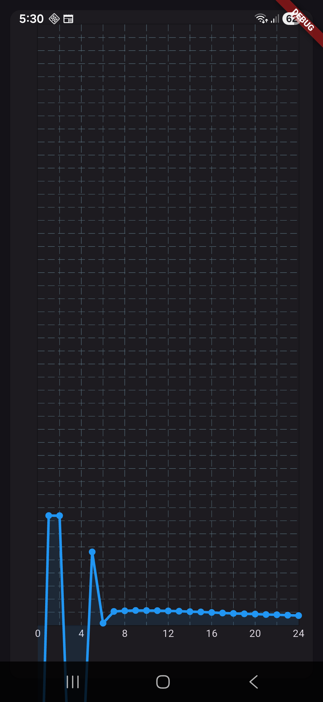
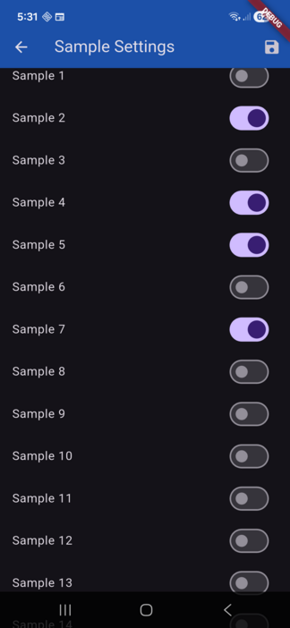
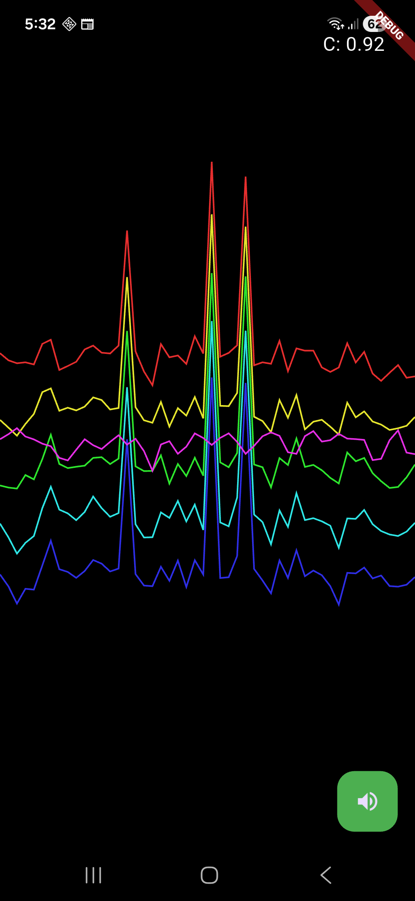

# wombat2

Flutter application 

PI detector samples arriving on the USB serial at 10 Hz.
(25 samples of the full discharge curve, averaged)

Coil Curve

Select samples to plot on time chart

Time chart and, signal-sound using difference between any two samples on coil curve

## Getting Started

